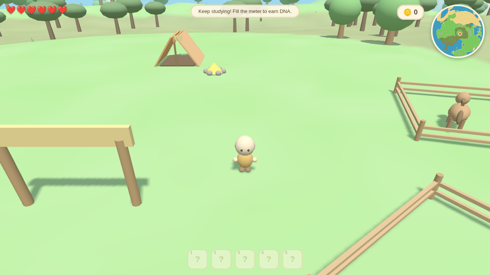
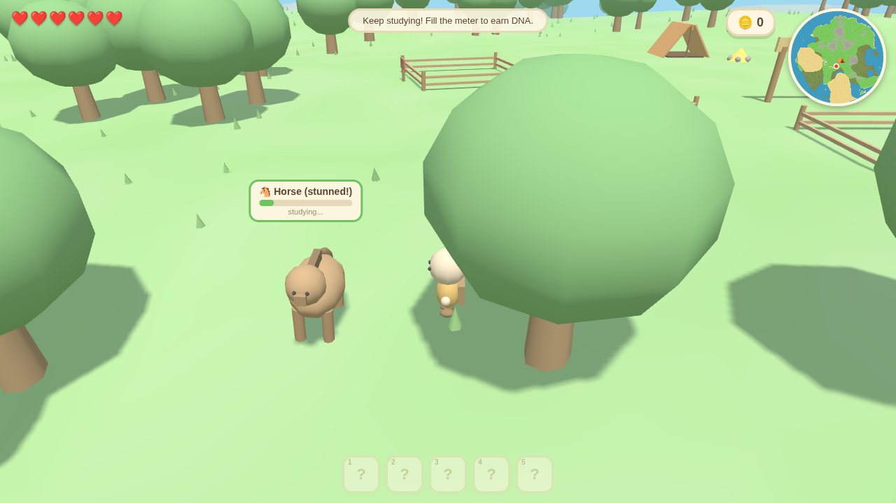
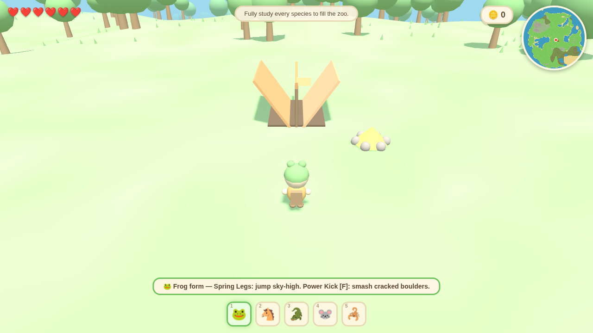
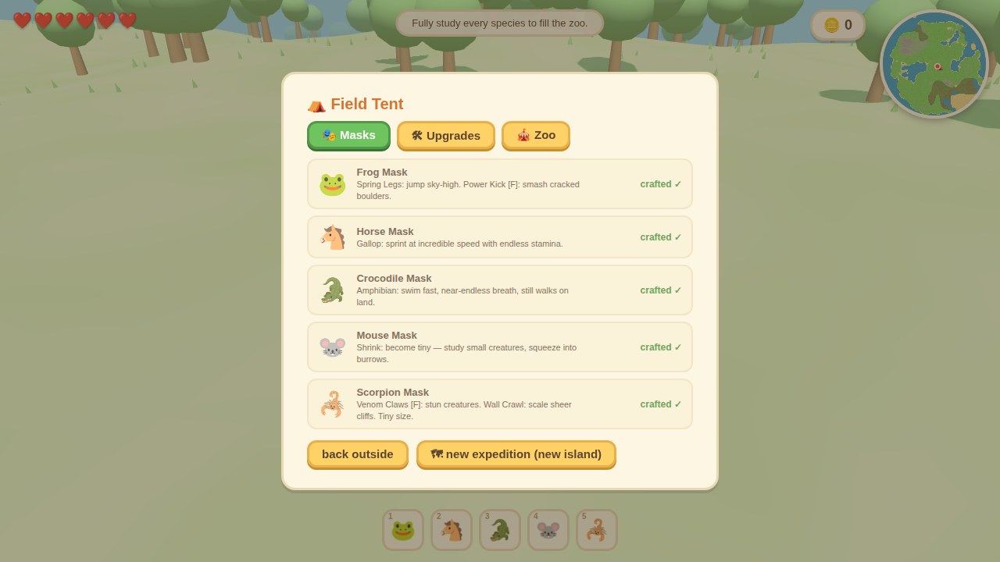

# 🎭 Wildmask

*A cozy open-world creature-study roguelike — in the chunky pastel style of a 3DS game.*

You're a field researcher dropped onto a **procedurally generated island**. Study the
wild animals, extract their DNA, craft **animal masks** at your field tent, and transform
into human-animal hybrids whose abilities unlock more and more of the island's terrain —
and the habitats of animals you couldn't reach before.

## ▶️ How to play

**Just open `index.html` in any modern browser.** No install, no build step, no server
needed — everything (including Three.js) is bundled in the repo.

## 🔄 The loop

1. **Explore** the island: plains, desert with sheer mesas, murky swamps, ponds, rocky
   terraces and a surrounding ocean. Every expedition generates a brand-new island.
2. **Study animals** — sneak close (crouch!) and **hold E** to fill their research meter.
   Partial progress is saved forever, even if they flee.
3. At 100%, you gain the species' **DNA**, and that animal is **sent to the zoo** at your
   base camp.
4. **Craft its mask** at the field tent ⛺ and wear it to transform.
5. **Zoo guests** wander into camp to see your exhibited animals and pay coins — spend
   them on tent upgrades (faster studying, quieter boots, more hearts, more guests).
6. If your hearts run out, the expedition ends… a **new island forms**, but your masks,
   zoo, coins and research all carry over (saved in your browser).

## 🎭 The masks

| Mask | Found in | Transformation |
|------|----------|----------------|
| 🐸 **Frog** | pond & swamp shores | Jump sky-high; **Power Kick [F]** smashes cracked boulders (coins inside!) and hops up rocky terraces |
| 🐴 **Horse** | open plains | Gallop at incredible speed with barely any stamina drain |
| 🐊 **Crocodile** | swamp water | Swim fast with near-endless breath — and still walk on land. Crocs treat you as kin and won't bite |
| 🐭 **Mouse** | plains | **Shrink** to tiny size: study small creatures and squeeze through the burrow network (fast travel!) |
| 🦂 **Scorpion** | desert | Tiny size, **Wall Crawl** up sheer mesa cliffs, and **Venom Claws [F]** that stun animals so they can't flee while you study them |

The island gates itself naturally: deep water drowns you without the croc, mesas are
unclimbable without the scorpion, scorpions are *literally too small to observe* until
you can shrink with the mouse mask, and crocodiles bite swimmers — study them from dry
land first.

 

## 🎮 Controls

| Key | Action |
|-----|--------|
| `W A S D` | move |
| `Shift` | sprint (stamina) |
| `Space` | jump |
| `C` | crouch / sneak (animals notice you much less) |
| `E` (hold) | study animal · enter tent · use burrow |
| `F` | frog kick / scorpion venom claws |
| `1–5` | wear a mask (press again or `X` to remove) |
| `Tab` / `N` | research notebook |
| mouse drag / `Q` `R` / wheel | camera |
| `H` | help |

## 🛠 Tech

- Plain HTML + JS, Three.js (vendored, r149) — runs from `file://`, zero dependencies.
- The whole island is one **analytic noise function** shared by the renderer, the
  physics, the animal AI and the minimap — no collision meshes.
- The signature 3DS "rolling world" look is a tiny vertex-shader patch applied to every
  material, curling geometry down with view distance (plus vertex-colored terrain, soft
  fog, pastel palette, and a day/night cycle).
- Meta progression persists in `localStorage`; each run reseeds the world.
