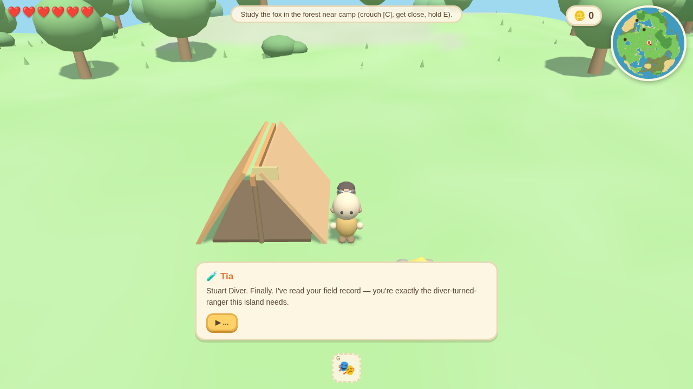
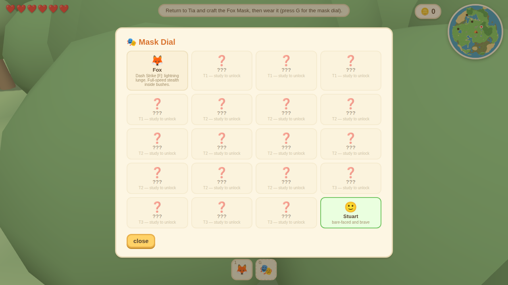
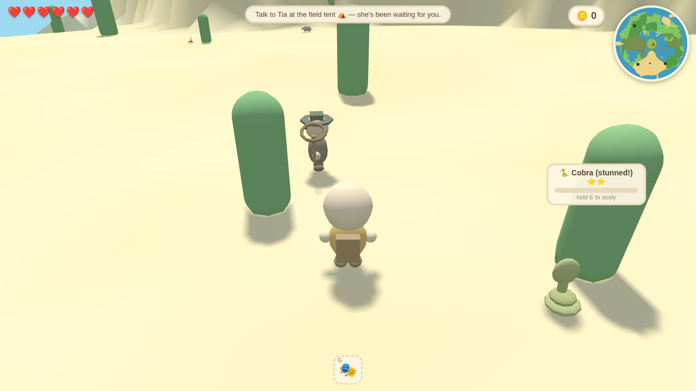
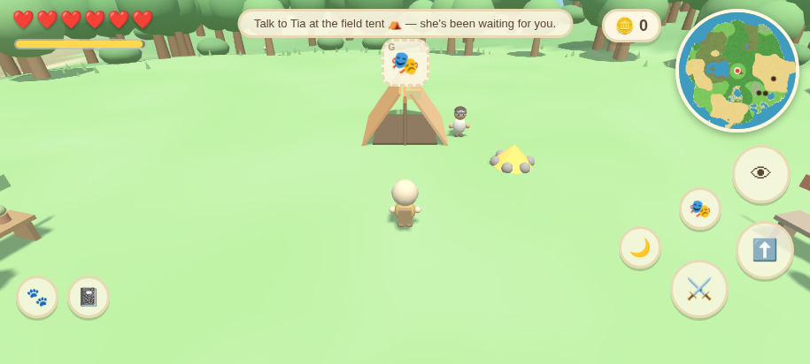

# 🎭 Wildmask

*A cozy low-poly open-world roguelike in the style of a 3DS game.*
**You are Stuart Diver**, field agent of the Wildmask Sanctuary Project. Study wild animals,
craft their DNA into masks, transform into human-animal hybrids — and fight the
**Poachers Guild** to protect the island's wildlife.

## ▶️ How to play

**Open `index.html` in any modern browser** — no install, no build. Everything (including
Three.js) is bundled. On a phone, see [Mobile & install](#-mobile--install) below.

## 🔄 The loop

1. **Explore** a procedurally generated island: plains, **forest**, desert mesas, swamps,
   ponds, rocky highlands and open ocean. Every expedition makes a new island.
2. **Study animals** — crouch, sneak close, **hold E**. Rarer/stronger animals take much
   longer to study (a fox is quick; a honey badger is a marathon). Progress is saved even
   if they flee. Nocturnal animals (owl, wolf) only appear at night.
3. At 100% you gain the species' **DNA** and it's sent to a safe **enclosure** in your camp
   zoo. **Guests** tour occupied enclosures and pay coins.
4. **Craft its mask** at Tia's tent and wear it (mask dial, **G**) to transform.
5. **Defend the wildlife.** The Poachers Guild patrols with nets and rifles, caging animals
   and hauling them to camps. Break their cages, knock the poachers out, and each mask
   gives you a distinct **fighting style**.
6. Death ends the expedition and reseeds the island — but masks, zoo, coins, research,
   plants and recipes all persist (saved in your browser).

## 🧑‍🤝‍🧑 Your camp

| Character | Role |
|-----------|------|
| **Tia** 🧪 | Invented the DNA mask press. Briefs you, and crafts masks from the DNA you collect. |
| **Cheryl** 🌼 | Botanist. Bring her wild **plants** (they glow, one type per biome) and she decorates enclosures — raising zoo appeal and guest income. |
| **Montana** 🍲 | Chef. Cooks **ingredients** — from crates the Guild leaves behind, or animals taken in self-defense — into buff dishes (heal, +max hearts, +attack, +breath). |

## 🎭 The 19 masks & fighting styles

Every studied species becomes a mask with a **movement power** and a **combat style**.

**⭐ Tier 1 (quick study)** — 🦊 Fox *(tutorial: dash-strike + full-speed bush stealth)*,
🐰 Rabbit *(double-jump)*, 🦌 Deer *(long leaps, antler charge)*, 🐸 Frog *(sky-high jump,
boulder-smashing kick)*, 🐴 Horse *(tireless gallop)*.

**⭐⭐ Tier 2** — 🐭 Mouse *(shrink + burrows)*, 🐢 Tortoise *(shell-guard block)*,
🦦 Otter *(fast swim)*, 🐍 Cobra *(ranged venom spit)*, 🐒 Monkey *(thrown fruit)*,
🐐 Mountain Goat *(climb any cliff, ram)*, 🛡️ Armadillo *(armored roll)*, 🦉 Owl
*(glide + night vision)*, 🦂 Scorpion *(wall-crawl, venom stun)*, 🐊 Crocodile *(swim,
huge breath, vice bite)*.

**⭐⭐⭐ Tier 3 (rare & strong)** — 🐺 Wolf *(tireless sprint, **howl [V]** scatters poachers)*,
🦅 Eagle *(glide + mid-air dive-bomb)*, 🐻 **Bear** *(massive swipes, huge knockback,
smashes boulders bare-handed)*, 🦡 **Honey Badger** *(blinding claw flurry, iron hide,
venom-immune — the hardest study on the island)*.

The island gates itself: deep water drowns you without the croc; mesas need scorpion/goat
climbing; scorpions are too small to observe until you shrink with the mouse; crocs bite
swimmers, so study them from dry land first.

## 📱 Mobile & install

- **Touch controls** appear automatically on phones/tablets: left thumb = virtual joystick
  (slam it to sprint), right thumb = camera (pinch to zoom), on-screen buttons for
  jump / attack / interact / mask dial / crouch / howl / notebook.
- **Install as an app (PWA):** open the game's URL on your Pixel (or any phone) in Chrome →
  menu → **Add to Home screen**. It installs with an icon and runs fullscreen & offline.
- **Android APK:** every push builds a debug APK via GitHub Actions
  (`.github/workflows/apk.yml`, Capacitor). Grab it from the **Actions** tab → latest
  *Build Android APK* run → **Artifacts → `wildmask-debug-apk`**, then install the `.apk`
  on your phone (enable "install unknown apps" for your browser/files app).
- **Hosting:** `.github/workflows/pages.yml` deploys the repo to GitHub Pages so you have a
  URL to open and install from.

## 🎮 Controls (keyboard)

| Key | Action |
|-----|--------|
| `W A S D` | move |
| `Shift` | sprint (armadillo → roll) |
| `Space` | jump · double-jump (rabbit) · **hold to glide** (owl/eagle) |
| `C` | crouch / sneak / tortoise shell-guard |
| `E` (hold) | study · talk · pick plants · use burrow |
| `F` | attack — differs per mask (dash, spit, dive, kick…) |
| `V` | special (wolf howl) |
| `G` / `1–9` / `X` | mask dial / quick-wear / remove |
| `Tab` / `N` | research notebook |
| drag / `Q` `R` / wheel | camera |

## 🛠 Tech

- Plain HTML + JS + Three.js (vendored, r149). Runs from `file://`; zero runtime deps.
- The island is one **analytic noise function** (`js/world.js` `G.sample`) shared by the
  renderer, physics, animal AI, poacher AI and minimap — no collision meshes.
- Every mesh is chunky spheres/boxes/cones with flat pastel Lambert colors; the signature
  3DS "rolling world" horizon is a per-material vertex-shader patch (`G.curve`).
- Files: `util · world · animal_builders · animals · combat · player · npcs · ui · mobile
  · main`. Meta progression persists in `localStorage`; each run reseeds the world.
